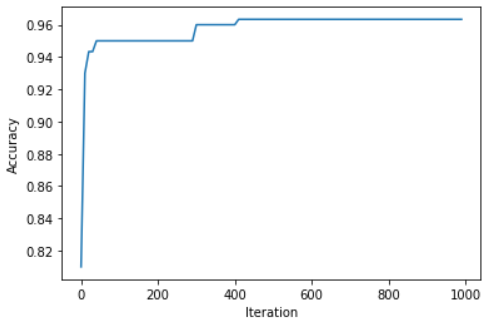

# SVM Parameter Optimization

This is a project on Parameter Optimization of a SVM model using random method.

### DataSet

Dataset used - Dry Bean DataSet 

Link - https://archive.ics.uci.edu/ml/datasets/Dry+Bean+Dataset

This is a multi class classification dataset. The Output class can be of types - Seker, Barbunya, Bombay, Cali, Dermosan, Horoz and Sira.

It contains no null values, and all attributes are numeric, so no preprocessing was used except for Standard Scalar for better performance of SVM model.

### Optimization

Three parameters are optimized in this project i.e. Kernel, epsilon (tolerance), C.

Epsilon & C were selected randomly from the range [0.001, 1.0] and kernel were choosen randomly from the kernel list i.e. Linear, rbf, poly, sigmoid.

10 samples of size 1000 were created from the dataset, which were split in 70-30 ratio for training and testing.

Model is trained on these parameters and then accuracy is measured for 1000 iterations.

The best accuracy and best parameters for the sample is recorded after every 10th iteration. The best overall sample list contains these record for the sample with best accuracy overall.

Record of best Accuracy for each sample:
| Sample # | Best Accuracy | Best Kernel | Best C | Best Epsilon |
| --- | --- | --- | --- | --- |
| 0 | 0.953333 | [rbf] | 0.718 | 0.194 |
| 1 | 0.963333 | [rbf] | 0.886 | 0.392 |
| 2 | 0.950000 | [linear] | 0.383 | 0.276 | 
| 3 | 0.940000 | [linear] | 0.773 | 0.629 |
| 4 | 0.963333 | [linear] | 0.711 | 0.333 |
| 5 | 0.943333 | [rbf] | 0.161 | 0.412 |
| 6 | 0.946667 | [rbf] | 0.771 | 0.149 |
| 7 | 0.946667 | [linear] | 0.588 | 0.157 |
| 8 | 0.956667 | [linear] | 0.733 | 0.632 |
| 9 | 0.953333 | [rbf] | 0.221 | 0.518 |

Top 5 records of Sample with best Accuracy

| iteration | bestAccuracy | bestKernel | bestC | bestEpsilon |
| --- | --- | --- | --- | --- |
| 0 | 0.926667 | [linear] | 0.199 | 0.846 |
| 10 | 0.926667 | [linear] | 0.199 | 0.846 |
| 20 | 0.926667 | [linear] | 0.199 | 0.846 |
| 30 | 0.940000 | [rbf] | 0.643 | 0.388 |
| 40 | 0.950000 | [rbf] | 0.632 | 0.229 |

At end, a plot is made between iteration and accuracy of the best sample that shows convergence is reached after a certain point.

Plot between Best Accuracy and Iterations

